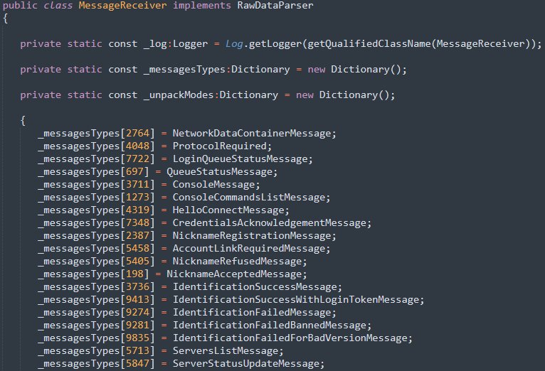

# DofusProtocolUpdater

Dofus protocol updater is based on [jpexs-decompiler](https://github.com/jindrapetrik/jpexs-decompiler). Its use is to
decompile Dofus and get variable information. For example, the network messages IDs sometimes changing on tuesday
updates.

### How to use

To use this updater,
call `VldbProtocolUpdater.updateManagers(File swfFile, List<VldbAbstractExportPackTaskBuilder> taskBuilders)`.

swfFile should be the DofusInvoker.swf file object.  
taskBuilders define the files to export, and how (at the moment, the only exportable files are "id by name managers",
let me explain).

### VldbAbstractExportPackTaskBuilder

As I said, the only exportable files are id by name managers (feel free to implement any other export type yourself if
needed !). What I call an id by name manager is a class with the sole purpose of managing names by ids, for example :

`MessageReceiver` holds an array called `_messagesTypes`. They represent the network messages by their id. You could
then export this with a `VldbIdByNameExportPackTaskBuilder(String fileName, IdByNameManager manager, String arrayName)`
with parameters :
 - fileName = MessageReceiver
 - manager = an instance of IdByNameManager which is a sort of bidirectional Map
 - arrayName = _messagesTypes

When calling `VldbProtocolUpdater.updateManagers` with this `VldbAbstractExportPackTaskBuilder`, the manager will first
be cleared then filled with the data found in the MessageReceiver class.