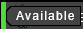

# VLDofusBot

Welcome to VLDofusBot, its goal is to help you automatize tedious tasks in the game. This is not a socket bot, it
will sniff the network to read the game's packets and will simulate clicks on the game window. No message will be sent
to the game server directly by the bot.

You can suggest new features or find help on discord : https://discord.gg/v45AA3dtYz

## Table of contents

* [Features](#features)
* [Getting started](#getting-started)
    - [Requirements](#requirements)
    - [Install the bot](#install-the-bot)
    - [Set up your game UI](#set-up-your-game-ui)
* [Tabs](#tabs)
    - [Loading](#loading)
    - [Scripts](#scripts)
        - [Characters](#characters)
        - [Global Scripts](#global-scripts)
        - [Individual Scripts](#individual-scripts)
    - [Settings](#settings)
    - [Metamob Helper](#metamob-helper)
        - [How to use](#how-to-use)
        - [Monsters display](#monsters-display)
        - [Trade Helper](#trade-helper)
    - [Exploration](#exploration)
    - [Jobs](#jobs)
    - [Auction House Item Finder](#auction-house-item-finder)
    - [Treasure Hunt Hints](#treasure-hunt-hints)
    - [Dev Tools](#dev-tools)

## Features

- [x] Move multiple characters at once using zaaps if needed, see it as an improved autopilot.
- [x] Explore all zaaps you're missing.
- [x] Explore areas to look for archmonsters, quest monsters, or just to kill present monsters.
- [x] Automatically update Metamob and display quest advancement.
- [x] Treasure hunts (this one should be half checked as it works but is not finished. You can
  check [this issue](https://github.com/viclew1/VLDofusBot/issues/8) to learn how to use it).
- [x] Smith magic (only 1 recipe for now, but everything's ready to implement more)
- [x] Filter items available in equipments auction house
- [ ] Raise mounts
- [ ] Fight in arena
- [x] Harvest jobs resources
- [ ] Return to bank when inventory full
- [ ] Dungeons + challenges
- [ ] Game's chat visible in the bot interface
- [x] Fight Dopples

## Getting started

### Requirements

To get started, you'll first need to install the bot. For this, you'll need :

- Git : [Download](https://git-scm.com/downloads)
- Npcap to use the sniffer : [Download](https://npcap.com/#download)

### Install the bot

To install or work on this project, you'll need to clone and build this project. Open a cmd where you want to
install the bot and type these commands :

- ```git clone https://github.com/viclew1/VLDofusBot```
- ```cd VLDofusBot```
- ```gradlew build```

Then, you can launch the built jar located in VLDofusBot\VLDofusBotApp\build\libs\VLDofusBotApp-xxx.jar

### Set up your game UI

You now need to avoid having elements in the way of clicks the bot can make, that means leaving all cells of the game
grid free of any UI element.


Other important things to do are to :

- use default theme (darkStone)
- use default hotkeys (F1 for ready and pass turn, H for haven bag, ...)
- disable display of every monster in a group
- set the fight summary window to reduced

## Tabs

### Loading

When starting VLDofusBot, you'll be greeted by this window :


If one of the operations fail, you'll get an error message describing what went wrong.
Most likely cases are :

- The game has been updated and the sniffer is not up-to-date
- You don't have npcap installed (refer to [Requirements](#requirements))
- You don't have the game installed, or it is installed in a custom location
  (not C:/users/your_profile/AppData/Local/Ankama/Dofus), the fix would be to install it in the default location or to
  put this location in your path variable.
- One of the bot files (stored in C:/users/your_profile/.VLDofusBot) is badly formatted

### Scripts

Once every loading operation has succeeded, well done, the bot should be usable ! You'll arrive to the scripts tab.
You can reach the other tabs with the buttons on the left.

#### Characters

On the left, there's a characters list. New characters are automatically added to it when you log them into the game.
They can have four different activity states, you can notice them using the colored bar on the left on the character's
card :

- Disconnected

  
- To initialize

  
- Available

  
- Busy

  

#### Global scripts

The page is, by default, in **Global** mode. Meaning you can run a script for multiple characters at once. Here I have
two characters selected on which the selected script will run.


#### Individual scripts

If you select a character (by clicking on its card), you'll enter **Individual** mode. In this mode, you can edit
your character's AI and run scripts only for him.

On the right, you can edit the spells your character will use when fighting.


If you want to return in Global mode, click on the **Global scripts** tab.

### Settings

If you move to the **Settings** tab, you'll be able to configure your bot. You can activate or not the sound alerts when
meeting an archmonster or a quest monster, enable overlays (feature in progress), set your metamob helper settings.


### Metamob Helper

#### How to use

You'll first need to set your metamob profile configuration which will be needed to
use Metamob Helper and to automatically update your account with the monsters you buy, capture or
trade. To disable these features, uncheck them under the **Metamob configuration** in the settings tab.

Start by fully synchronizing your game account with your metamob's account by putting every soulstone you own in a
character's haven bag chest, then running the script **Update Metamob** on this character.

Every time you update your monsters, the archmonsters you don't own will have their statuses changed to *searched* and
the ones you have multiple times will be changed to *offered*.

#### Monsters display

You can dynamically view your metamob monsters in this tab. You can filter the list and check what you've caught, what
you're missing, etc. It will be automatically updated every time a monster event is received (capture, trade,
purchase) but you can also manually refresh it if needed.

The soul's price will also be displayed for every archmonster (and updated every time you open the auction house
archmonsters soul stone offers).

#### Trade Helper

If you click on the arrow on the right of the metamob helper, the trade helper will open. Here, you can simulate a trade
to easily calculate what trade you want to offer (or to check if you're getting scammed). You can even copy a trade
offer by clicking on the copy button at the bottom (the message is only with the monsters in French at the moment and,
for my example bellow, will be "*Bandapar 79k, Tofuldebeu 274k VS Boufdégou 119k, Pioulbrineur 120k, Nodkoku 99k*").


### Exploration

You can see here which maps you went through in the last 2 hours. The bluer the cell, the more recently the map has been
explored. If it's red, it means it's been explored at least 2 hours ago (or never).

You can select up to five areas using ctrl + click. On the right panel, you'll see which monsters/harvestables are in
these areas and,
for monsters, how many you've already captured for your ocher.

Your connected character are displayed at the bottom, in the "Last explorations" panel. You can send them to explore the
selected areas (respecting the parameters you picked on the left panel). You can also stop their running scripts or
resume the exploration.

If you want to harvest items while exploring, you can pick the harvestable set you want in the exploration parameters
panel. For more information on harvestable set, see [Jobs](#jobs)

In the seen monsters panel, you'll have a recap of the quest monsters and archmonsters you've seen. You can gather all
of your non-busy characters on the monster's map by clicking the gather button at the top right of the monster card.

You can also display hidden areas using the floor selector on the top left of the map.


### Jobs

In this tab, you can manage harvestable sets. By default, there are two sets: one in which there is no item selected ("
Nothing"), and one in which all items are selected ("Everything").

To create one, you first need to give it a name and create it using the add button.
Then, you can configure the set by selecting the different items you want your character to harvest.

Once the set is created, you can use it in the [Exploration Tab](#exploration).


### Auction House Item Finder

The auction house item finder allows you to search the auction house for the perfect item. To use it, you need to load
the item prices in game. By doing so, you will see all the items available in the right part of the screen. Then, you
can use the filters on the left side to only show the items with the amount of characteristics you are looking for.

You can also add additional characteristics on the bottom left. By default, only the three basic ones (given they are
not already in the native characteristics) are displayed, but you can add other additional characteristics by using
the "Add filter" button.


### Treasure Hunt Hints

This tab can be used to register new treasure hunt hints and manage the ones already registered.

To add a new hint, you need to load the map GFXs of the character by using the search button at the top of the screen.
You will then see all the GFXs (the ones already added, as well as those you didn't add yet) of the map your character
is on. You then need to select the hint and add it using the "Add GFX to hint" at the bottom of the screen.

If you've made a mistake and you need to delete a hint, you can look for the hint and use the delete button at the top
right of the registered hints section.


### Dev Tools

TODO