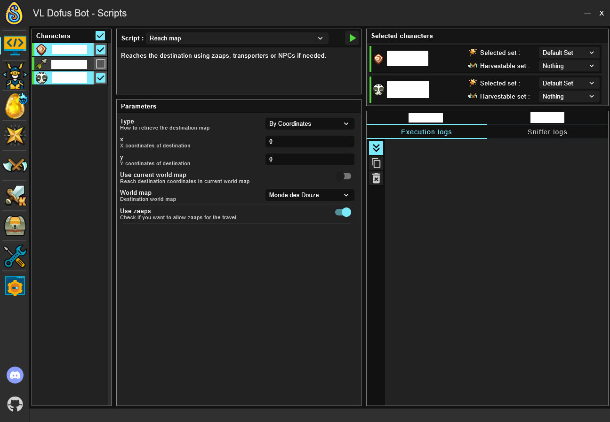
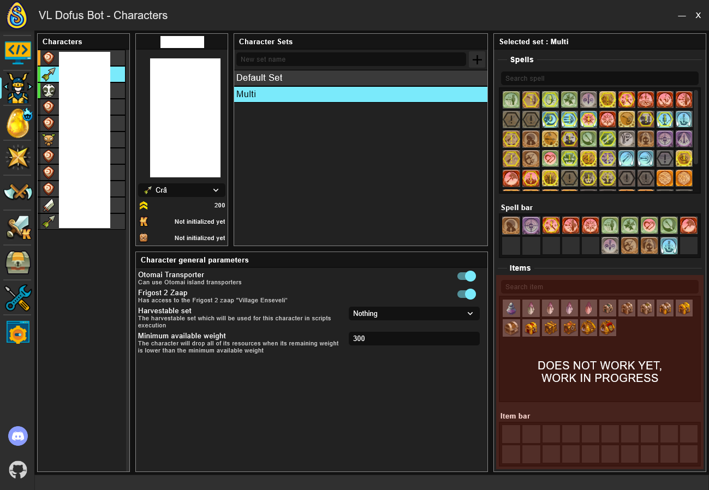
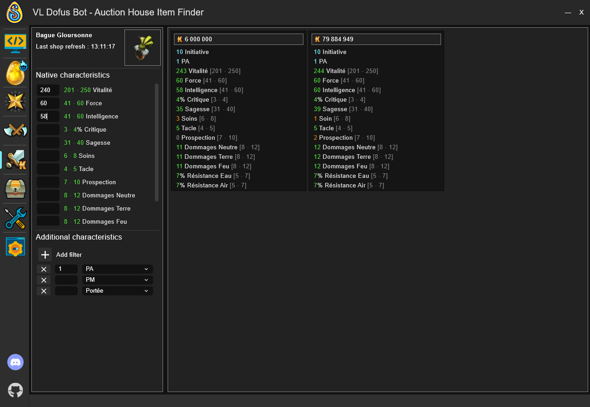
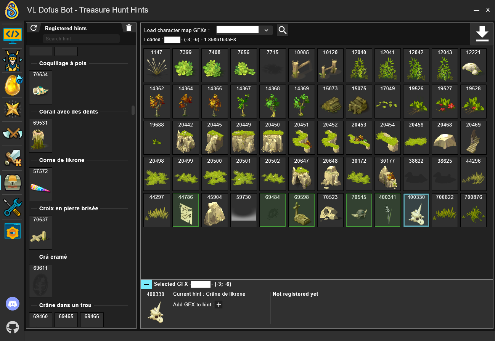
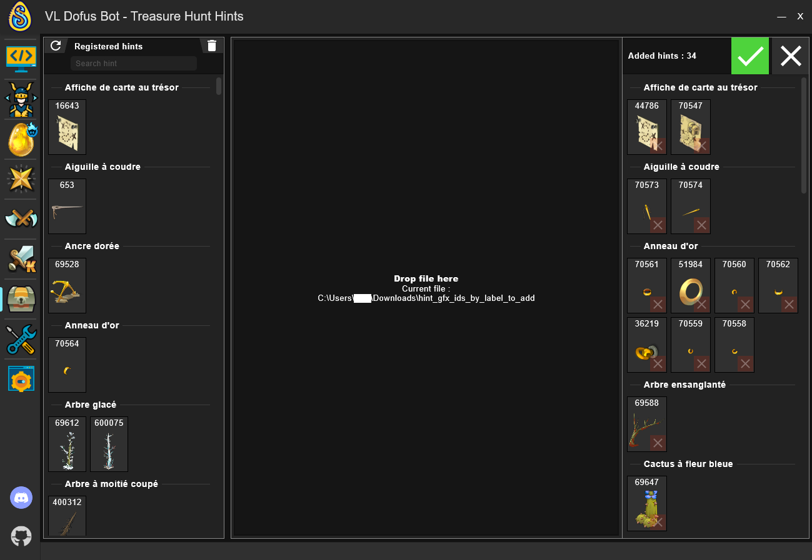

# VLDofusBot

**The code of the bot is now private, if you want to download it, head to the releases and get the latest one!**

Welcome to VLDofusBot, its goal is to help you automatize tedious tasks in the game. This is not a socket bot, it
will sniff the network to read the game's packets and will simulate clicks on the game window. No message will be sent
to the game server directly by the bot.

You can suggest new features, report bugs or find help on Discord : https://discord.gg/v45AA3dtYz

## Table of contents

* [Features](#features)
* [Getting started](#getting-started)
    - [Requirements](#requirements)
    - [Install the bot](#install-the-bot)
    - [Set up your game UI](#set-up-your-game-ui)
* [Tabs](#tabs)
    - [Loading](#loading)
    - [Scripts](#scripts)
        - [Connected characters](#connected-characters)
        - [How to use scripts](#how-to-use-scripts)
    - [Characters](#characters)
    - [Settings](#settings)
    - [Metamob Helper](#metamob-helper)
        - [How to use](#how-to-use)
        - [Monsters display](#monsters-display)
        - [Trade Helper](#trade-helper)
    - [Exploration](#exploration)
    - [Jobs](#jobs)
    - [Auction House Item Finder](#auction-house-item-finder)
    - [Treasure Hunt Hints](#treasure-hunt-hints)
        - [How to import new hints](#how-to-import-new-hints)

## Features

- [x] Move multiple characters at once using zaaps if needed, see it as an improved autopilot.
- [x] Explore all zaaps you're missing.
- [x] Explore areas to look for archmonsters, quest monsters, or just to kill present monsters.
- [x] Automatically update Metamob and display quest advancement.
- [x] Treasure hunts (this one should be half checked as it works but is not finished. You can
  check [this issue](https://github.com/viclew1/VLDofusBot/issues/8) to learn how to use it).
- [x] Smith magic (only 1 recipe for now, but everything's ready to implement more)
- [x] Filter items available in equipments auction house
- [x] Harvest jobs resources
- [x] Fight Dopples
- [x] Return to bank when inventory full
- [ ] Raise mounts
- [ ] Fight in arena
- [ ] Dungeons + challenges

## Getting started

### Requirements

To get started, you'll first need to install the bot. For this, you'll need :

- Java **(at least version 11, at most 20. [Java 17](https://www.oracle.com/fr/java/technologies/downloads/#java17) will do just fine.)**
- Npcap to use the sniffer : [Download](https://npcap.com/#download)

### Install the bot

To install or work on this project, just download the latest release, unzip it, and run the exe. You're good to go!

### Set up your game UI

You now need to avoid having elements in the way of clicks the bot can make, that means leaving all cells of the game
grid free of any UI element.

Other important things to do are to :

- use default theme (darkStone)
- use default hotkeys (F1 for ready and pass turn, H for haven bag, ...)
- disable display of every monster in a group
- set the fight summary window to reduced

## Tabs

### Loading

When starting VLDofusBot, you'll be greeted by this window :

If one of the operations fail, you'll get an error message describing what went wrong.
Most likely cases are :

- The game has been updated and the sniffer is not up-to-date
- You don't have npcap installed (refer to [Requirements](#requirements))
- You don't have the game installed, or it is installed in a custom location
  (not C:/users/your_profile/AppData/Local/Ankama/Dofus), the fix would be to install it in the default location or to
  put this location in your path variable.
- One of the bot files (stored in C:/users/your_profile/.VLDofusBot) is badly formatted

### Scripts

Once every loading operation has succeeded, well done, the bot should be usable! You'll arrive to the scripts tab.
You can reach the other tabs with the buttons on the left.

#### Connected characters

On the left, there's a characters list. Connected characters are automatically added to it when you log them into the
game. There are four different activity states, indicated by the colored bar on the left of the character's card:

- Disconnected

  
- To initialize

  
- Available

  
- Busy

  

#### How to use scripts

On this page, you can select one or multiple characters on which you can run a script. Here I have two characters
selected on which the selected script will run. You can also change the set and harvestable set your characters use on
the top right side of the tab. You can create and manage sets in the [Characters](#characters) tab and harvestable sets
in the [Jobs](#jobs) tab.

### Characters

This tab is used to manage your characters. On the left section of the page, you can see a list of all the characters
you have already logged in to the game with the bot open.
If you select one character, you can manage this character's parameters and sets.

First, you can create new sets in the section "Character Sets". To do this, you need to set a name and use the "add"
button. You can also edit your sets by selecting it in the list and editing it. For each set, you can choose different
spells you want the AI to use in fights. You will also be able to select different items you want your character to
use (work in progress, does not work yet). Of course, the spell bar and item bar in the bot have to match the ones of
your character in the game.

Next, you can also manage the general parameters of your characters at the bottom of the screen. Those parameters are
not part of the sets.

### Settings

If you move to the **Settings** tab, you'll be able to configure your bot. You can activate or not the sound alerts when
meeting an archmonster or a quest monster, enable overlays (feature in progress), set your metamob helper settings.

### Metamob Helper

#### How to use

You'll first need to set your metamob profile configuration which will be needed to
use Metamob Helper and to automatically update your account with the monsters you buy, capture or
trade. To disable these features, uncheck them under the **Metamob configuration** in the settings tab.

Start by fully synchronizing your game account with your metamob's account by putting every soulstone you own in a
character's haven bag chest, then running the script **Update Metamob** on this character.

Every time you update your monsters, the archmonsters you don't own will have their statuses changed to *searched* and
the ones you have multiple times will be changed to *offered*.

#### Monsters display

You can dynamically view your metamob monsters in this tab. You can filter the list and check what you've caught, what
you're missing, etc. It will be automatically updated every time a monster event is received (capture, trade,
purchase) but you can also manually refresh it if needed.

The soul's price will be displayed and updated for every archmonster every time you open the auction house
archmonsters soul stone offers.

#### Trade Helper

If you click on the arrow on the right of the metamob helper, the trade helper will open. Here, you can simulate a trade
to easily calculate what trade you want to offer (or to check if you're getting scammed). You can even copy a trade
offer by clicking on the copy button at the bottom (the message is only with the monsters in French at the moment and,
for my example bellow, will be "*Bandapar 79k, Tofuldebeu 274k VS Boufdégou 119k, Pioulbrineur 120k, Nodkoku 99k*").

### Exploration

You can see here which maps you went through in the last 2 hours. The bluer the cell, the more recently the map has been
explored. If it's red, it means it's been explored at least 2 hours ago (or never).

You can select up to five areas using ctrl + click. On the right panel, you'll see which monsters/harvestables are in
these areas and,
for monsters, how many you've already captured for your ocher.

Your connected character are displayed at the bottom, in the "Last explorations" panel. You can send them to explore the
selected areas (respecting the parameters you picked on the left panel). You can also stop their running scripts or
resume the exploration.

If you want to harvest items while exploring, you can pick the harvestable set you want in the exploration parameters
panel. For more information on harvestable set, see [Jobs](#jobs)

In the seen monsters panel, you'll have a recap of the quest monsters and archmonsters you've seen. You can gather all
of your non-busy characters on the monster's map by clicking the gather button at the top right of the monster card.

You can also display hidden areas using the floor selector on the top left of the map.

### Jobs

In this tab, you can manage harvestable sets. By default, there are two sets: one in which there is no item selected ("
Nothing"), and one in which all items are selected ("Everything").

To create one, you first need to give it a name and create it using the add button.
Then, you can configure the set by selecting the different items you want your character to harvest.

Once the set is created, you can use it in the [Exploration Tab](#exploration).

### Auction House Item Finder

The auction house item finder allows you to search the auction house for the perfect item. To use it, you need to load
the item prices in game. By doing so, you will see all the items available in the right part of the screen. Then, you
can use the filters on the left side to only show the items with the amount of characteristics you are looking for.

You can also add additional characteristics on the bottom left. By default, only the three basic ones (given they are
not already in the native characteristics) are displayed, but you can add other additional characteristics by using
the "Add filter" button.

### Treasure Hunt Hints

This tab can be used to register new treasure hunt hints and manage the ones already registered.

To add a new hint, you need to load the map GFXs of the character by using the search button at the top of the screen.
You will then see all the GFXs (the ones already added, as well as those you didn't add yet) of the map your character
is on. You then need to select the hint and add it using the "Add GFX to hint" at the bottom of the screen.

If you've made a mistake and need to delete a hint, you can look for the hint and use the delete button at the top
right of the registered hints panel.

#### How to import new hints

As you can see on the screen above, there is a button on the top right of your screen that you can click on to import
hints.

Once you click on the import button, a new panel will expand, as you can see on the screen below. There, you can drop a
hint file (you can find your own hints file hint_gfx_ids_by_label in C:\Users\your_user\.VLDofusBot and you can share it
in the dedicated discord channel), and the bot will identify which ones you don't have yet in the section named "added
hints". You can reject the hints you think are wrong with the "reject" button at the bottom of each hint, and you can
add all by clicking the "Accept All" button at the top right of the tab.

