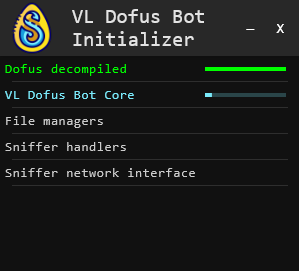
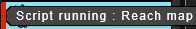
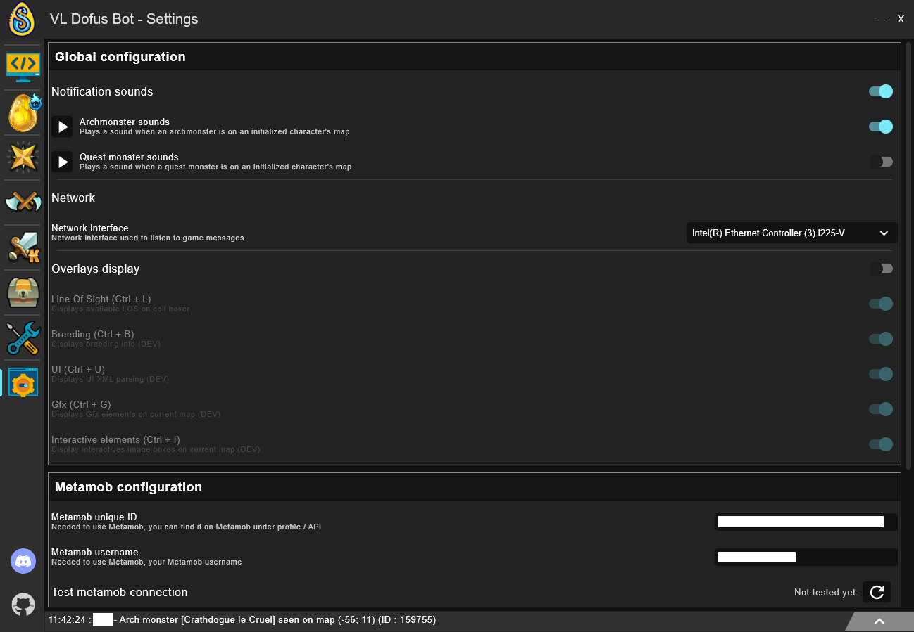
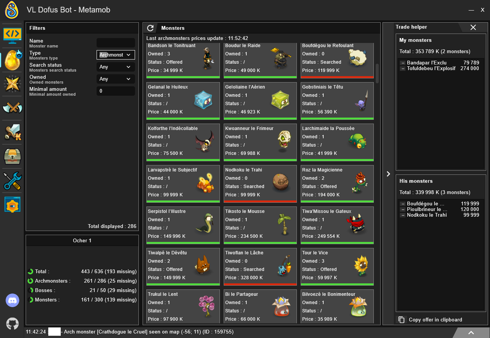

# VLDofusBot

[](README.md)

Bienvenue sur VLDofusBot. Le but de ce bot est de vous aider à automatiser des tâches fastidieuses du jeu. Il ne s'agit
pas d'un bot socket : le bot sniffe le réseau pour lire les paquets du jeu et simule les clics sur la fenêtre du jeu.
Aucun message ne sera envoyé directement par le bot au serveur du jeu .

Vous pouvez suggérer de nouvelles fonctionnalités ou trouver de l'aide sur le discord : https://discord.gg/v45AA3dtYz

## Table des matières

* [Fonctionnalités](#fonctionnalités)
* [Installation](#installation)
    - [Prérequis](#prérequis)
    - [Installer le bot](#installer-le-bot)
    - [Configuration de l'interface](#configuration-de-l'interface)
* [Onglets](#tabs)
    - [Chargement](#chargement)
    - [Scripts](#scripts)
        - [Personnages](#personnages)
        - [Script Global](#script-global)
        - [Script Individuel](#script-individuel)
    - [Paramètres](#paramètres)
    - [Metamob helper](#metamob-helper)
        - [Fonctionnement](#fonctionnement)
        - [Affichage des monstres](#affichage-des-monstres)
        - [Assistant d'échange](#assistant-d'échange)
    - [Exploration](#exploration)
    - [Métiers](#métiers)
    - [Recherche d'items en HDV](#recherche-d'items-en-hdv)
    - [Indices de chasses au trésor](#indices-de-chasses-au-trésor)
    - [Outils de Dev](#outils-de-dev)

## Fonctionnalités

- [x] Déplacer plusieurs personnages à la fois en utilisant les zaaps si nécessaire (voyez le comme un autopilote
  amélioré).
- [x] Explorer tous les zaaps qui vous manquent.
- [x] Explorer des zones à la recherche d'archi-monstres, de monstres de quête, ou simplement pour tuer des monstres.
- [x] Mettre à jour automatiquement Metamob et afficher votre avancée dans la quête.
- [x] Les chasses au trésor (cette fonctionnalité devrait être à moitié cochée car elle fonctionne mais n'est pas
  finie. Voir [cette issue](https://github.com/viclew1/VLDofusBot/issues/8) pour apprendre à l'utiliser).
- [x] La forgemagie (une seule recette pour l'instant, mais tout est prêt pour en implémenter d'autres).
- [x] Filtrer les items disponibles dans l'HDV équipements.
- [x] Récolter des ressources de métiers
- [x] Combattre les dopeuls
- [ ] Élever des montures
- [ ] Combattre en kolizeum
- [ ] Retourner à la banque quand l'inventaire est plein
- [ ] Donjons et challenges

## Installation

### Prérequis

La première étape est d'installer le bot. Pour cela, il vous faudra :

- Java <span style="color:red">**(version 11 minimum)**</span>
- Git : [Télécharger](https://git-scm.com/downloads)
- Npcap pour utiliser le sniffer : [Télécharger](https://npcap.com/#download)

### Installer le bot

Pour installer ou travailler sur ce projet, vous devez le cloner et le build. Pour cela, ouvrez un cmd dans le dossier
où vous voulez installer le bot et tapez ces commandes :

- ```git clone https://github.com/viclew1/VLDofusBot```
- ```cd VLDofusBot```
- ```gradlew build```

Ensuite, vous pouvez lancer le jar qui se trouve dans VLDofusBot\VLDofusBotApp\build\libs\VLDofusBotApp-xxx.jar

### Configuration de l'interface

En ce qui concerne l'interface, le moins d'éléments d'interface possible doivent se trouver là où le bot pourrait
cliquer. Cela signifie qu'aucun élément d'interface ne peut se trouver au-dessus des cellules du jeu.


Autres points importants à respecter :

- utiliser le thème par défaut (darkStone)
- utiliser les raccourcis par défaut (F1 pour prêt et pour passer le tour, H pour le havre-sac,...)
- désactiver l'affichage de tous les monstres d'un groupe
- mettre la fenêtre de fin de combat en mode réduit (le récapitulatif de combat avec les loots)

## Onglets

### Chargement

Au lancement de VLDofusBot, vous arrivez sur cette fenêtre :



Si une des étapes échoue, vous recevrez un message d'erreur décrivant ce qui s'est passé.
Les problèmes les plus probables sont :

- Le jeu a été mis à jour, mais pas le sniffer.
- Vous n'avez pas installé Npcap (voir [Prérequis](#prérequis)).
- Vous n'avez pas installé le jeu, ou il n'est pas installé dans le dossier par défaut (C:
  /users/votre_profil/AppData/Local/Ankama/Dofus). Pour régler ce problème, vous pouvez installer le jeu à l'emplacement
  par défaut ou ajouter son emplacement à la variable d'environnement path.
- L'un des fichiers du bot (stockés dans C:/users/votre_profil/.VLDofusBot) est mal formaté.

### Scripts

Une fois que toutes les étapes du chargement ont été réalisées, félicitations, vous devriez pouvoir utiliser le bot ! Le
premier onglet sur lequel vous arriverez est celui des scripts.
Vous pouvez accéder aux autres onglets avec les boutons sur la gauche.

#### Personnages

Sur la gauche de l'onglet de script, vous trouverez une liste de personnages. Les nouveaux personnages sont
automatiquement ajoutés à cette liste lorsque vous les connectez au jeu.
Les personnages peuvent avoir quatre états d'activité différents que vous pouvez voir grâce à la barre colorée à gauche
de la carte du personnage.

- Déconnecté

  
- À initialiser

  
- Disponible

  
- Occupé

  

#### Script Global

Par défaut, l'onglet des scripts est ouvert sur le mode **Global**. Cette section vous permet de lancer un script sur
plusieurs personnages en même temps. Sur le screen ci-dessous, par exemple, j'ai sélectionné deux personnages pour
lesquels le script choisi sera exécuté.


#### Script Individuel

Si vous sélectionnez un personnage (en cliquant dessus), vous entrerez dans le mode **Individual**. Ce mode vous
permet de lancer un script sur ce personnage uniquement. Sur la droite, vous pourrez également modifier les sorts
utilisés par l'IA de combat de votre personnage.


Pour retourner dans le mode global, cliquez sur l'onglet **Global scripts** en haut de la section des scripts.

### Paramètres

Dans l'onglet des **Paramètres**, vous pouvez configurer votre bot. Vous pouvez activer ou non les alertes sonores
lorsque vous rencontrez un archi-monstre ou un monstre de quête, activer les overlays (fonctionnalité en développement)
et paramétrer votre assistant metamob.



### Metamob helper

#### Fonctionnement

Commencez par paramétrer votre profil metamob. Cela sera nécessaire pour utiliser le Metamob Helper et pour mettre à
jour automatiquement votre compte et y ajouter les monstres que vous achetez, capturez ou échangez. Si vous souhaitez
désactiver ces fonctionnalités, vous devez les décocher dans l'onglet [Paramètres](#paramètres), dans la section
**Metamob configuration**.

Commencez par mettre à jour votre compte metamob avec les monstres que vous possédez en jeu en déposant toutes vos
pierres dans le coffre du havre-sac d'un personnage et en lançant le script **Update Metamob** sur ce personnage.

À chaque fois que vous mettez à jour vos monstres, le statut des archi-monstres que vous ne possédez pas passera à
*recherché*, et celui de ceux que vous possédez en plusieurs exemplaires passera à *offert*.

#### Affichage des monstres

Dans cet onglet, vous pouvez visualiser les monstres de votre compte metamob. Vous pouvez filtrer la liste
et vérifier quels monstres vous avez capturés, ceux qui vous manquent, etc.

Le prix de la pierre sera affiché et mis à jour pour chaque archi-monstres à chaque fois que vous ouvrirez les
offres de pierre d'âme d'archi-monstre de l'HDV.

#### Assistant d'échange

En cliquant sur la flèche à droite de l'onglet Metamob Helper, vous ouvrirez l'assistant d'échange. Avec cet outil, vous
pouvez simuler un échange. Cela vous permet de plus facilement calculer les valeurs d'un échange que vous voulez
faire (ou de vérifier que vous ne vous faites pas arnaquer). Vous pouvez également copier un échange en utilisant le
bouton "copy offer on clipboard" en bas du simulateur d'échange (pour l'exemple qui suit : "*Bandapar 79k, Tofuldebeu
274k VS Boufdégou 119k, Pioulbrineur 120k, Nodkoku 99k*")



### Exploration

Sur cette carte, vous pouvez voir les maps que vous avez explorées au cours des 2 dernières heures. Plus la cellule est
bleue, plus la map a été explorée récemment. Si la map est rouge, cela signifie qu'elle a été explorée il y a au moins 2
heures (ou jamais).
Vous pouvez sélectionner jusqu'à 5 zones en utilisant ctrl + clic. Dans la section de droite, vous verrez quels
monstres/ressources récoltables se trouvent dans ces zones, et, pour les monstres, lesquels vous avez déjà capturés.

Les personnages qui sont connectés sont affichés en bas de la page, dans la section "Last explorations". Vous pouvez les
envoyer
explorer les zones sélectionnées (les paramètres sur la section de gauche seront pris en compte).

Si vous souhaitez récolter des ressources pendant l'exploration, vous pouvez choisir un harvestable set (ensemble de
récolte) dans les paramètres d'exploration. Pour plus d'informations sur les harvestable sets, voir [Métiers](#métiers).

Dans la section "Seen Monsters", vous trouverez un récapitulatif des monstres de quête et des archi-monstres que vous
avez rencontrés. Vous pouvez rassembler tous vos personnages disponibles sur la map du monstre que vous souhaitez en
cliquant sur le bouton de rassemblement en haut à droite de l'icône du monstre.

Vous pouvez également afficher les zones cachées à l'aide des boutons de sélection d'étages situés en haut à gauche de
la carte.


### Métiers

Dans cet onglet, vous pouvez gérer et créer des harvestable sets. Deux sets sont créés par défaut : un set où aucune
ressource
récoltable n'est sélectionnée ("Nothing"), et un set où toutes les ressources récoltables sont sélectionnées ("
Everything").

Pour créer un set, vous devez d'abord lui donner un nom et le créer en utilisant le bouton "ajouter". Ensuite, vous
pouvez configurer le set en sélectionnant les différentes ressources que vous souhaitez récolter.

Une fois le set créé, vous pouvez l'utiliser dans [l'onglet d'exploration](#exploration).


### Recherche d'items en HDV

L'onglet Auction House Item Finder vous permet de rechercher l'objet idéal dans l'HDV. Pour l'utiliser, vous devez
d'abord consulter les prix des objets en jeu. Ce faisant, vous verrez alors tous les objets disponibles en HDV dans la
partie droite de la page. Ensuite, vous pourrez utiliser les différents filtres dans la partie gauche pour ne filtrer
que les objets qui possèdent les caractéristiques recherchées.

Vous pouvez également ajouter des caractéristiques additionnelles dans la section en bas à gauche (Additional
characteristics). Par défaut, seules les trois caractéristiques de base sont affichées (à condition qu'elles ne figurent
pas déjà dans les Native characteristics), mais vous pouvez en ajouter d'autres en utilisant le bouton "add filter".


### Indices de chasses au trésor

Cet onglet peut être utilisé pour enregistrer de nouveaux indices de chasses au trésor et pour gérer ceux qui sont
déjà enregistrés.

Pour ajouter un nouvel indice, vous devez charger les GFXs du personnage à l'aide du bouton de loupe en haut de la page.
Vous verrez ainsi tous les GFXs (ceux que vous avez déjà ajoutés, ainsi que ceux que vous n'avez pas encore ajoutés) de
la carte sur laquelle se trouve votre personnage. Ensuite, vous devez sélectionner le GFX de l'indice que vous
recherchez et l'ajouter en utilisant le bouton "Add GFX to hint" en bas de la page.

Si vous vous êtes trompés et souhaitez supprimer un indice, vous pouvez rechercher l'indice érroné et utiliser le
bouton de suppression en haut à droite de la section "Registered hints".


### Outils de Dev

TODO
